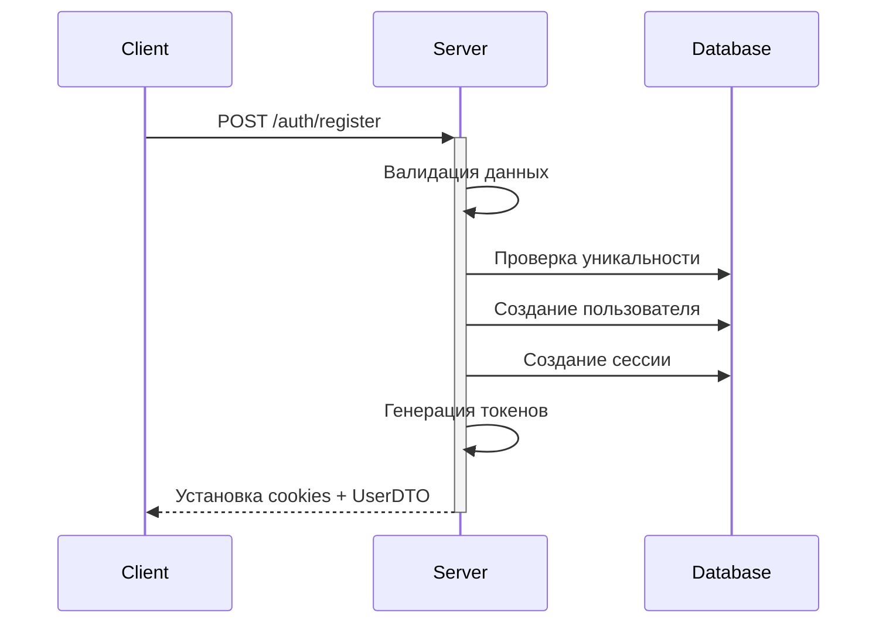
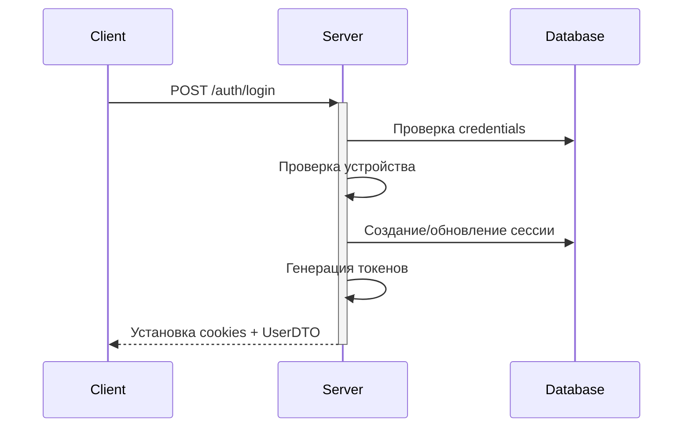
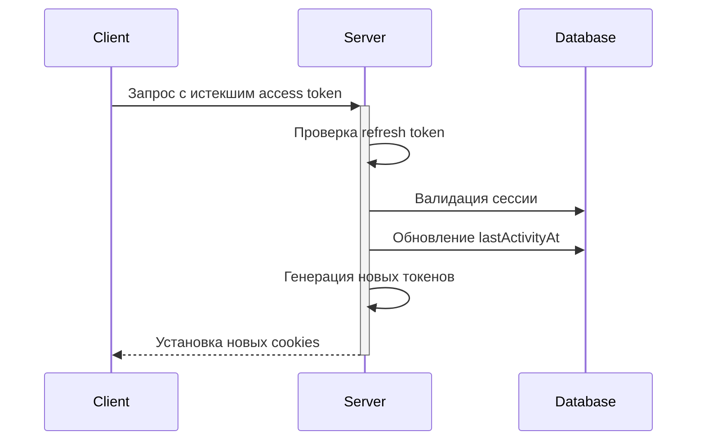
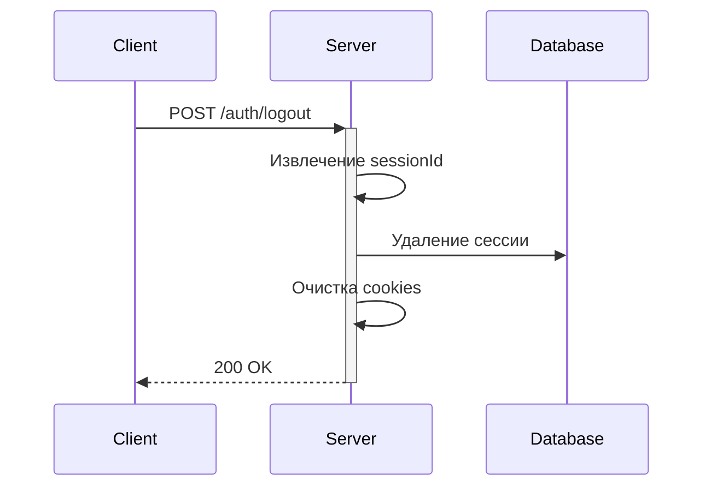

# Документация по системе аутентификации

## Общее описание
Система аутентификации построена на основе JWT токенов с использованием механизма refresh token для продления сессий. Реализована поддержка множественных сессий с различных устройств с учетом безопасности и ограничений.

## Основные компоненты

### 1. Токены
- **Access Token**: Короткоживущий токен (5 минут)
   - Используется для авторизации запросов
   - Содержит: ID пользователя, ID сессии, время последней активности
   - Хранится в httpOnly cookie

- **Refresh Token**: Долгоживущий токен (7 дней)
   - Используется для обновления access token
   - Содержит: ID пользователя, ID сессии, время последней активности
   - Хранится в httpOnly cookie

### 2. Сессии
- Максимум 5 активных сессий на пользователя
- Хранят информацию об устройстве и геолокации
- Автоматически очищаются после 30 дней не активности

## Бизнес-процессы

----

### 1. Регистрация

#### Процесс:
- Получение данных пользователя 
- Валидация:
  - Email (формат и уникальность)
  - Username (уникальность)
  - Пароль (сложность)
- Создание пользователя
- Создание сессии
- Генерация пары токенов. set-cookie

### 2. Аутентификация

#### Процесс:
- Проверка credentials 
- Определение устройства 
- Управление сессиями:
  - Новое устройство: создание сессии
  - Существующее: обновление 
- Генерация токенов 
- Установка cookies

### 3. Обновление токенов

#### Процесс:
- Получение refresh token из cookie 
- Валидация токена 
- Проверка сессии 
- Обновление времени активности 
- Генерация новой пары токенов

### 4. Выход из системы

#### Процесс:
1. Получение refresh token
2. Извлечение sessionId
3. Удаление сессии
4. Очистка cookies
5. Очистка контекста безопасности