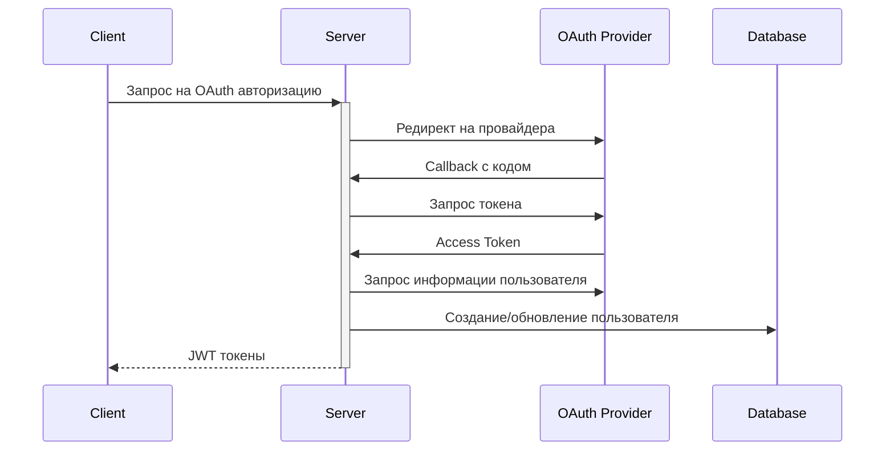

# Issues для модуля аутентификации

## Высокий приоритет

### 1. Интеграция OAuth 2.0
- [ ] Добавить авторизацию через Google
    - Настройка Google OAuth credentials
    - Реализация OAuth callback endpoint
    - Обработка Google user info
    - Связывание с существующими аккаунтами

- [ ] Добавить авторизацию через GitHub
    - Настройка GitHub OAuth App
    - Реализация OAuth callback endpoint
    - Обработка GitHub user info
    - Связывание с существующими аккаунтами

### 2. Безопасность
- [ ] Добавить rate limiting для попыток входа
    - Ограничение по IP
    - Временная блокировка после N неудачных попыток
    - Уведомление пользователя о попытках входа

- [ ] Улучшить валидацию паролей
    - Проверка против списка популярных паролей
    - Запрет использования личной информации в пароле
    - Минимальная энтропия пароля

### 3. Управление сессиями
- [ ] Добавить принудительный выход со всех устройств при смене пароля
- [ ] Добавить уведомления о новых сессиях

## Средний приоритет

### 4. Подтверждение email
- [ ] Отправка verification email при регистрации
- [ ] Ограничение функционала для неподтверждённых email
- [ ] Возможность повторной отправки verification email

### 5. Восстановление пароля
- [ ] Реализация forgot password flow
- [ ] Ограничение времени жизни reset token
- [ ] Защита от брутфорса reset token

### 6. Двухфакторная аутентификация
- [ ] Интеграция с Google Authenticator
- [ ] Генерация резервных кодов
- [ ] Настройка принудительного 2FA для определённых ролей

## Низкий приоритет

### 7. Аудит безопасности
- [ ] Логирование важных событий безопасности
- [ ] История входов с различных устройств
- [ ] Уведомления о подозрительной активности

### 8. Улучшение UX
- [ ] Remember me функционал
- [ ] Автоматический выход при длительной неактивности
- [ ] Предупреждение об истечении сессии

### 9. Рефакторинг
- [ ] Вынести конфигурацию в отдельный сервис
- [ ] Добавить интерфейсы для основных сервисов
- [ ] Улучшить обработку ошибок

## Технические детали

### OAuth 2.0 Flow



### Необходимые эндпоинты

```
POST /auth/oauth/google/init
GET /auth/oauth/google/callback
POST /auth/oauth/github/init
GET /auth/oauth/github/callback
POST /auth/oauth/unlink
GET /auth/oauth/connections
```